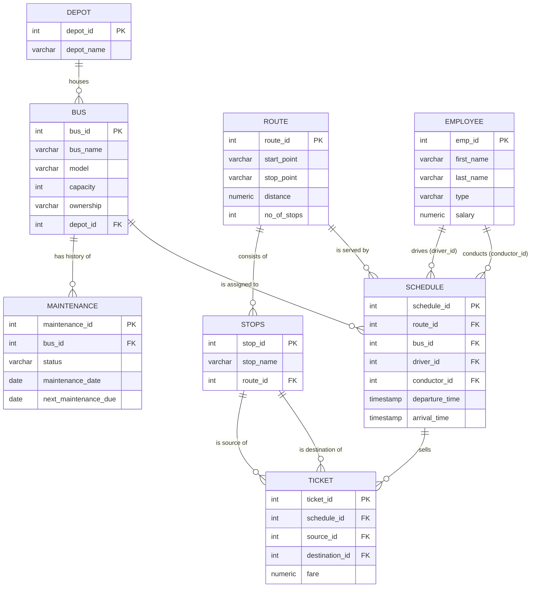

# Trip Management System — Corrected ERD

Provincial bus company trip management system. This revision applies the feedback
raised during the presentation of the initial ERD (`ERD_LT1.png`).

## Fixes applied (from presentation feedback)

1. **Maintenance history preserved (was 1-to-1 with Bus).**
   `MAINTENANCE` is now one-bus-to-many-records: each maintenance event is its own
   row (`maintenance_id` PK, `maintenance_date`, `next_maintenance_due`) instead of
   a single per-bus record whose `last_maintenance` / `next_maintenance` fields were
   overwritten on every service. The misleading `insurance_id` PK is renamed to
   `maintenance_id`.

2. **Depot–Bus cardinality corrected (was drawn "many-to-zero").**
   The relationship is now `DEPOT ||--o{ BUS`: one depot houses **zero or many**
   buses — a newly opened depot can legitimately have no buses yet.

3. **Employee–Schedule made one-to-many (was 1-to-1).**
   `SCHEDULE` now represents an **actual dated trip** (`departure_time` /
   `arrival_time` timestamps rather than a fixed recurring template), so one
   employee can work many schedules over time as long as they don't conflict.
   The two roles are separate FKs: `driver_id` and `conductor_id`.

## Additional design decision

- **`TICKET.schedule_id` added.** In the original ERD a ticket referenced only its
  source/destination stops, so it wasn't tied to any particular trip. Linking each
  ticket to a `SCHEDULE` row makes it a true trip transaction (who traveled on which
  dated departure), enabling per-trip manifests and revenue reporting.
